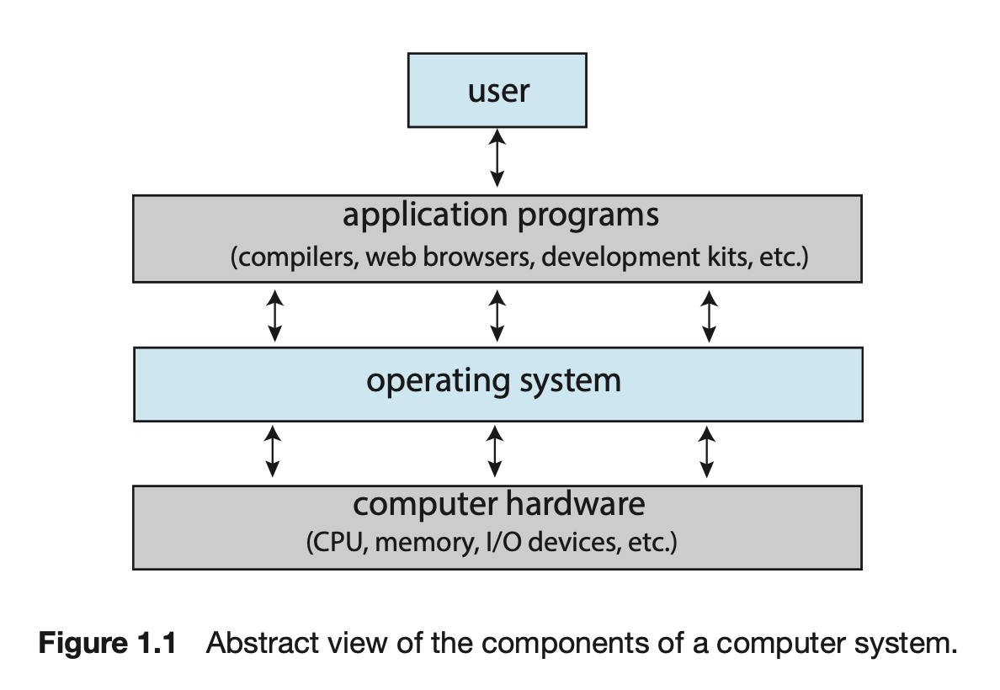

---
# # multilingual page pair id, this must pair with translations of this page. (This name must be unique)
# lng_pair: id_autogeneratedsamplecontent_3
# title: _autogeneratedsamplecontent_

# post specific
# if not specified, .name will be used from _data/owner/[language].yml
#author: ""
# multiple category is not supported
category: Operating System
# multiple tag entries are possible
tags: [Operating System]
# thumbnail image for post
img: ":os-logo.png"
# disable comments on this page
comments_disable: false

# publish date
date: 2023-02-13 00:26:08 +0900
---
<body>
  
</body>

Operating System Concepts 10th를 참조하여 정리한 글이다. 

--------------

### 운영체제(Operating System)이란?
1. 컴퓨터의 하드웨어를 다루는 소프트웨어
2. Application program에 기초적인 요소를 제공
3. 사용자와 하드웨어 사이에 중재자(intermediary)와 역할을 수행

### 운영체제(Operating System)가 하는 일
Computer system 4개의 main component들로 나누어진다.
* Hardware
  * central processing unit (CPU), the memory, and the input/output (I/O) devices     
* Operating System
* Application Programs
  * word processors, spreadsheets, compilers, and web browsers
* User

### 관점
#### 사용자 관점(User View)
+ 운영체제는 사용에 용이성 
+ 수행과 보안성
+ 자원 활용(resource utilization)에 무시

#### 시스템 관점(System View)
+  Resource allocator , Manager of these resources.
    > 다음과 같은 문제를 해결하기 위해    
    > CPU time, memory space, storage space, I/O devices, and so on.

+  Control program. 
    > 에러나 부적절한 컴퓨터 사용을 막기위해 유저 프로그램 실행을 관리
    

**Moore’s Law**
18개월 마다 integrated circuit에 있는 transitor 갯수가 2배 증가 

### 운영체제 정의하기
운영체제는 커널(kernel)이라고 불리는 프로그램이다. 커널은 컴퓨터에 항상 실행(run)된다.
커널 중 다른 프로그램 종류
1. system program
   > OS와 연관되었지만 필요한 커널의 요소는 아니다.
2. application program
   > 모든 프로그램에 속하지만 시스템 동작에 속하지 않는다. 

### 컴퓨터시스템 구조(Computer-System Organization)
modern general-purpose computer system
+ CPU 
+ Device controller
  + > 버스(bus) 통해서 연결된다. 그리고 공유된 메모리와 컴포넌트들 사이에 접근을 제공한다.(Figure 1.2).
  + > 예) disk drive, audio device, graphics display

일반적으로, OS는 각각의 device controller에 대해 device driver를 가진다. 
    > Device driver는 device controller를 이해하고 device에 적합한 interface를 가진 운영체제를 제공한다.

--------------

### Interrupt
I/O operation 시작
   1. device driver가 device controller에 적절한 register들을 실른다.
   2. Device controller는 어떤 행동을 취할지 판단하기 위해 register들의 내용물들을 확인한다. 
   3. Controller는 device -> local buffer들로 data를 전송한다.
데이터 전송 완료되면 controller는 drvier에게 완료되었다고 알린다.
  1. 그 driver는 다른 OS의 요소들에게 control을 제공한다.
  2. 가능한 data, pointer , status information와 같은 값들을 반환

controller가 driver에게 operation이 끝났다는 것을 알리는 것은 `interrupt`를 통해 이뤄질 수 있다.

#### 개요

하드웨어는 인터럽트를 언제든지 CPU에 신호를 전달하므로서 발생할 수 있다.
(보통 `시스템 버스` 방식에 의해 전달된다.)
> 시스템 버스는 주요 컴포넌트들 간에 communications path이다.

인터럽트는 많은 다른 목적을 가지고 있다. 더불어, 어떻게 OS과 하드웨어 간 상호작용하는지 핵심 요소이기도 하다.
CPU에서 인터럽트가 발생되었을 때 그것은 하는 것을 멈추고 fixed location에 즉시 실행을 전달한다. fixed location는 일반적으로 인터럽트가 위치되어 있는 서비스 루틴이 위치한 시작하는 주소를 포함한다.
그 인터럽트 서비스 루틴은 실행한다. 완료일 때, 그 CPU는 인터럽트된 계산을 재개한다.
이 실행의 타임라인은 아래 그림1과 같이 보여진다.

인터럽트는 컴퓨터 아키텍쳐의 중요한 요소이다. 각 컴퓨터 디자인은 그것만의 인터럽트 동작을 가지고 있다. 그러나, 몇몇의 함수들은 공통적이다. 인터럽트는 반드시 컨트롤을 적합한 인터럽트 서비스 루틴에 전달한다. 그 방식은 인터럽트 정보를 나타나기 위해 공통적인 루틴을 요청을 하기 위해 하는 것이다. 
그 루틴은 차례로 interrupt-specific handler 부른다.
그러나, 인터럽트들은 반드시 빠르게 다루어진다. 그들은 매우 빈번하게 발생되어 진다. 
인터럽트에 대한 포인터들의 테이블은 필요한 속도를 제공하기 위해 대신하여 사용되어 진다. 그 인터럽트 루틴은 간접적으로 테이블을 통하여 불러진다. 일반적으로, 그 포인터들의 테이블은 낮은 메모리에 저장되어진다. 이 위치들은 다양한 디바이스들 인터럽트 서비스 루틴의 주소들을 가지고 있다. 인터럽트하는 디바이스를 인터럽트 서비스 루틴의 주소를 제공하기 위해 인터럽트 요청이 주어진 이 주소들의 배열(또는 인터럽트 벡터)은 그 후 특별한 수에 의해 색인되어진다.
윈도우 그리고 유닉스와 다른 운영체제도 이와 같은 방식으로 인터럽트 내보낸다. 

인터럽트 아키텍쳐는 또한 반드시 인터럽트된 무엇이든지 state information를 저장해야한다. 그래야 인터럽트를 제공한 뒤에 이 정보를 복원할 수 있기 때문이다.
만약 인터럽트 루틴이 프로세스 상태를 수정할 필요가 있다면 그것은 명백하게 최근 상태를 저장해야하고 그후 리턴하기 전에 그 상태를 복원할 수 잇다.
인터럽트가 발생한 뒤, 그 저장된 리턴 주소는 PC에 로드되어진다. 그리고 인터럽트된 계산은 비록 인터럽트가 발생하지는 않았더라도 재개한다.

### 수행
기초적인 인터럽트 작동원리는 다음과 같이 진행한다. CPU 하드웨어는  `interrupt-request line`가진다.
> interrupt-request line는 모든 instruction 실행한 뒤 CPU가 감지하는 선이다.

CPU가 컨트롤이 interrupt-request line에 신호가 어썰트되는 것을 감지할 때, 그것은 인터럽트 번호를 읽고 그리고 인터럽트 번호를 사용하므로서 다른 interrupt-handler routine로 넘어간다.
그후 색인된 주소에서 시작을 한다. 그 인터럽트 핸들러는 실행 중에 변할 것 같은 어떤 상태든 저장하고
인터럽트의 요인을 결정한다. 필요한 프로세싱을 수행한다, 상태 복원을 수행한다 그리고 언터럽트 인스트럭션으로부터 

----------

 It then starts execution at the address associated with that index. The interrupt handler saves any state it will be changing during its operation, determines the cause of the interrupt, performs the necessary processing, performs a state restore, and executes a return from interrupt instruction to return the CPU to the execution state prior to the interrupt. We say that the device controller raises an interrupt by asserting a signal on the interrupt request line, the CPU catches the interrupt and dispatches it to the interrupt handler, and the handler clears the interrupt by servicing the device. 

Figure 1.4 summarizes the interrupt-driven I/O cycle.
The basic interrupt mechanism just described enables the CPU to respond to an asynchronous event, as when a device controller becomes ready for service. In a modern operating system, however, we need more sophisticated interrupt- handling features.
1. We need the ability to defer interrupt handling during critical processing.
2. We need an efficient way to dispatch to the proper interrupt handler for
a device.
1. We need multilevel interrupts, so that the operating system can distin- guish between high- and low-priority interrupts and can respond with the appropriate degree of urgency.
In modern computer hardware, these three features are provided by the CPU and the interrupt-controller hardware.

