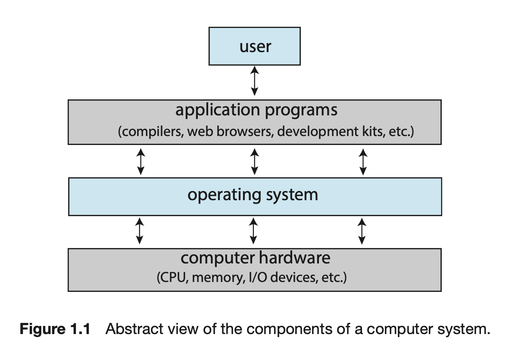
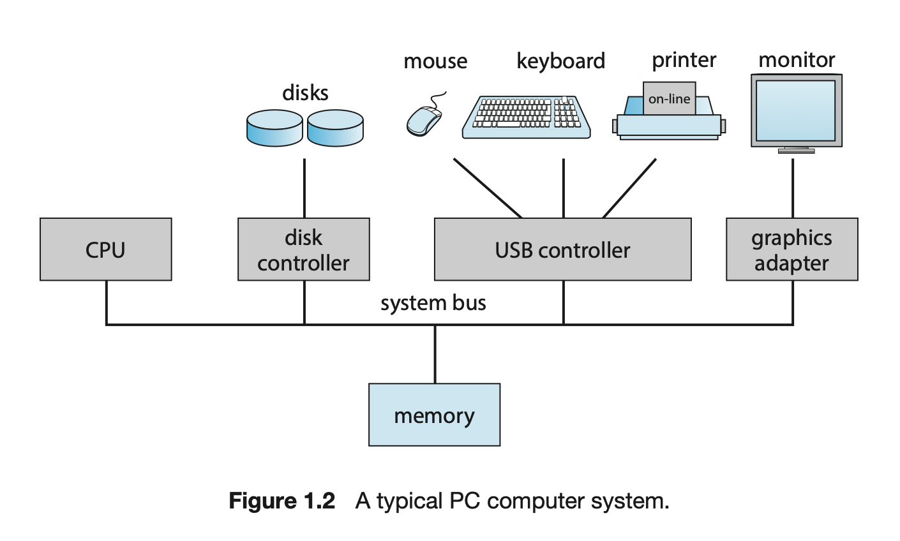

---
# # multilingual page pair id, this must pair with translations of this page. (This name must be unique)
# lng_pair: id_autogeneratedsamplecontent_3
# title: _autogeneratedsamplecontent_

# post specific
# if not specified, .name will be used from _data/owner/[language].yml
#author: ""
# multiple category is not supported
category: Operating System
# multiple tag entries are possible
tags: [Operating System]
# thumbnail image for post
img: ":os-logo.png"
# disable comments on this page
comments_disable: false

# publish date
date: 2023-02-13 00:26:08 +0900
---
<body>
  
</body>

Operating System Concepts 10th를 참조하여 정리한 글이다. 

### 운영체제(Operating System)이란?
1. 컴퓨터의 하드웨어를 다루는 소프트웨어
2. Application program에 기초적인 요소를 제공
3. 사용자와 하드웨어 사이에 중재자(intermediary)와 역할을 수행

### 운영체제(Operating System)가 하는 일
Computer system 4개의 main component들로 나누어진다.
* Hardware
  * central processing unit (CPU), the memory, and the input/output (I/O) devices     
* Operating System
* Application Programs
  * word processors, spreadsheets, compilers, and web browsers
* User

### 관점
#### 사용자 관점(User View)
+ 운영체제는 사용에 용이성 
+ 수행과 보안성
+ 자원 활용(resource utilization)에 무시

#### 시스템 관점(System View)
+  Resource allocator , Manager of these resources.
    > 다음과 같은 문제를 해결하기 위해    
    > CPU time, memory space, storage space, I/O devices, and so on.

+  Control program. 
    > 에러나 부적절한 컴퓨터 사용을 막기위해 유저 프로그램 실행을 관리
    

**Moore’s Law**
18개월 마다 integrated circuit에 있는 transitor 갯수가 2배 증가 

### 운영체제 정의하기
운영체제는 커널(kernel)이라고 불리는 프로그램이다. 커널은 컴퓨터에 항상 실행(run)된다.
커널의 종류
1. system program
   > OS와 연관되었지만 필요한 커널의 요소는 아니다.
2. application program
   > 모든 프로그램에 속하지만 시스템 동작에 속하지 않는다. 

### 컴퓨터시스템 구조(Computer-System Organization)
modern general-purpose computer system
+ CPU 
+ Device controller
  + > 버스(bus) 통해서 연결된다. 그리고 공유된 메모리와 컴포넌트들 사이에 접근을 제공한다.(Figure 1.2).
  + > 예) disk drive, audio device, graphics display

일반적으로, OS는 각각의 device controller에 대해 device driver를 가진다. 
    > Device driversms device controller를 이해하고 device에 적합한 interface를 가진 운영체제를 제공한다.

### Interrupt
I/O operation 시작
   1. device driver가 device controller에 있는 적절한 register들을 `load`
   2. Device controller는 어떤 행동을 취할지 판단하기 위해 register들의 내용물들을 확인한다. 
   3. Controller는 device -> local buffer들로 data를 전송한다.
데이터 전송 완료되면 controller는 drvier에게 완료되었다고 알린다.
  1. 그 driver는 다른 OS의 요소들에게 control을 제공한다.
  2. 가능한 data, pointer , status information와 같은 값들을 반환

controller가 driver에게 operation이 끝났다는 것을 알리는 것은 `interrupt`를 통해 이뤄질 수 있다.

#### Overview
하드웨어는 언제든지 CPU에게 인터럽트 시그널을 보낼 수 있다. system bus 방식으로.
어떻게 운영체제와 하드웨어가 상호작용르 할 수 있는지 중요한 핵심이다.
CPU가 인터럽트 할때, 하는 작업을 중단하고 즉시 고정된 장소(fixed location)에 실행을 전송한다. 그 고정된 장소는 인터럽트가 위치한 service routine인 주소를 시작하는 것을 포함한다. 그 인터럽트 시비스 루틴이 실행된다. 완료할 때, 그 CPU는 인터럽트된 작업을 재개한다.

<!-- 인터럽트는 컴퓨터 아키텍쳐에 중요한 요소이다.
각 컴퓨터 디자인은 인터럽트 메커니즘을 가진다 그러나 몇몇의 함수들은 흔하다.
인터럽트는 컨트롤를 전송한다. 적합한 인터럽트 서비스 루틴에 그 간단한 방식은 전송을 관리하는 제너릭 루틴을 횐기한다 인터럽트 정보를 보여주기 위해.
그 루틴은 interrupt-specific handler를 부를 것이다. 그러나,
인터럽트들은 빠르게 다루어진다. 그들이 발생하는 바로 즉각적으로 포인터들의 테이블들은 인터럽트 루틴들에 있는 필요한 속드를 제공하기위해 대신 사용되어 진다.
그 인터럽트 루틴은 테이블을 통한 간접적으로 call 되어진다. 루틴에 필요한 중재자 없는 채로 일반적으로, 그 포인터들의 테이블은 낮은 메모리에 저장된다. 이 장소는 다양한 장치들에 대한 인터럽트 서비스 루틴들의 주소들을 가지고 있다. 인터럽트 요청을 받은 이 배열 또는 주소에 대한 인터럽트 벡터는 특별한 수에 대한 index되어진다. 인터럽트가 발생한 서비스에 대해 인터럽트 서비스 루틴을 제공하기 위한 것이다. 인터럽트 요청을  given with the interrupt request, to provide the address of the interrupt service routine for the interrupting device. Operating systems as different as Windows and UNIX dispatch interrupts in this manner.
The interrupt architecture must also save the state information of whatever was interrupted, so that it can restore this information after servicing the interrupt. If the interrupt routine needs to modify the processor state—for instance, by modifying register values — it must explicitly save the current state and then restore that state before returning. After the interrupt is serviced, the saved return address is loaded into the program counter, and the interrupted computation resumes as though the interrupt had not occurred. -->