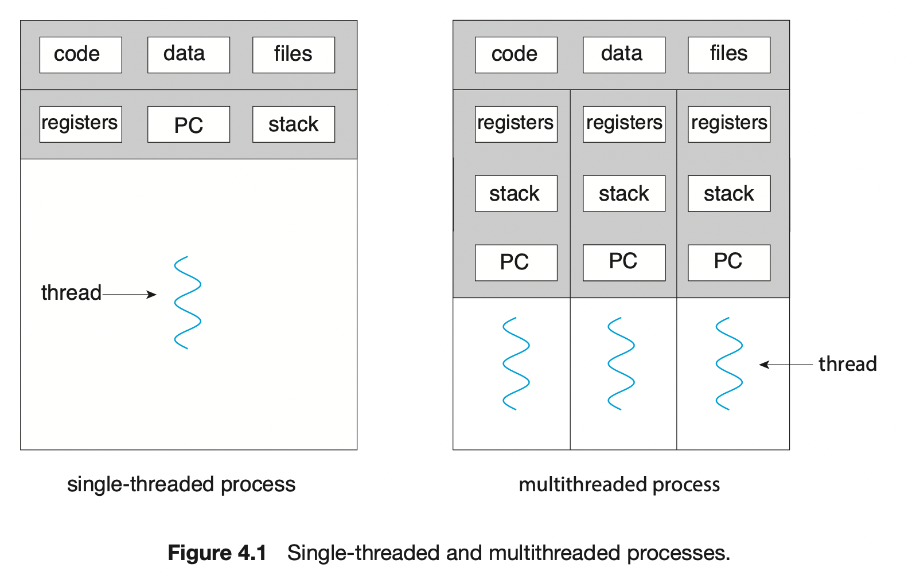
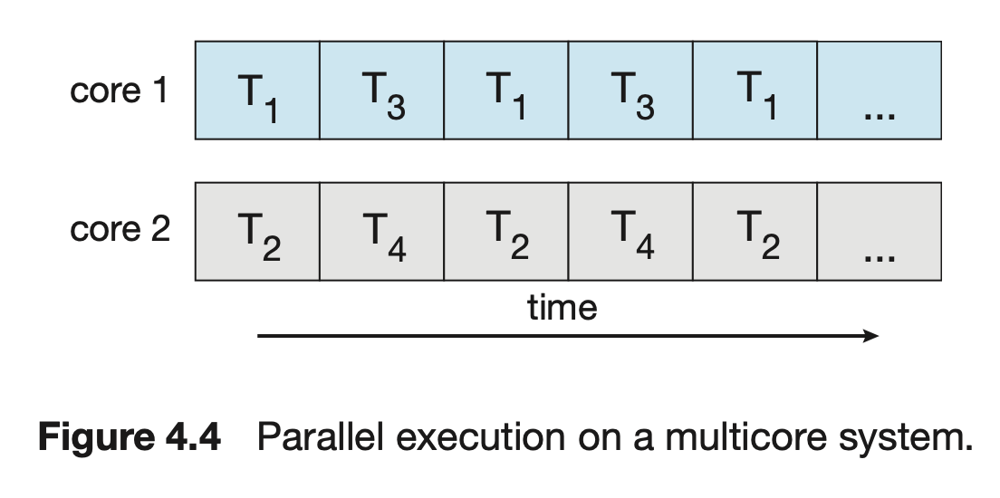

---

# multiple category is not supported
category: Operating System
# multiple tag entries are possible
tags: [Operating System]
# thumbnail image for post
img: ":os-logo.png"

# publish date
date: 2023-02-14 20:14:00 +0900
---

### 쓰레드(thread)
프로세스는 앞에서 소개 했다시피 쓰레드 컨트롤을 가진 프로그램을 실행한다. 가상적으로 모든 현대 운영체제에서는 컨트롤 중 멀티 쓰레드들을 포함한 프로세스를 가능하게 기능들을 제공한다. 쓰레드들의 사용을 통하여 `병렬 처리(parallelism)` 기능을 확인하는 것이 멀티 CPU가 제공하는 현대 멀티코어 시스템에서  점차적으로 중요하다.

#### 개요
의미: CPU 활동의 기초적인 단위이다.   
구성: thread ID, a program counter (PC), a register set, a stack

같은 프로세스에 속하는 다른 쓰레드와 공유한다.
예를 들어, code 영역, data 영역, and other operating-system 구성들 
(예로 open file 과 signal)   

전통적으로 프로세스는 한 개의 쓰레드를 가진다. 만약 프로세스가 멀티 쓰레드를 가진다면 한 작업보다 더많이 수행할 수 있다.  

싱글 쓰레드 프로세스 & 멀티쓰레드 프로세스

### 멀티 쓰레드의 이점
1. `반응성 (Responsiveness)` 
   프로그램이 중단되거나 길게 동작을 수행하는 프로그램이 동작을 계속할 수 있도록 한다.
2. `구성 공유 (Resource sharing)` 
3. `절약 (Economy)` 
   프로세스를 만드는 것에 있어 메모리와 구성들을 할당하는 것은 비용이 상당하다. 쓰레드는 프로세스의 구성들을 공유하기 떄문이다. 이것은 쓰레드를 만들고 `context switch`컨텍스트 스위치하기 위해 경제적이다.실증적으로 overhead에서 차이점을 파악하기는 힘들지만, 일반적으로 쓰레드 생성이 프로세스 생성보다 시간과 메모리를 덜 소비한다. 추가적으로, context switching는 프로세스보다 쓰레드 사이에서 더 빠르다. 
4. `확장성 (Scalability)` 

### 멀티코어 프로그래밍
#### `동시성(concurrency)` 와 `병렬 처리 (parallelism)` 의미 차이

**동시성**

그림2

단일 CPU 코어에서 처리되며 `context switching`을 통해 빠르게 프로세스 간에 전환되면서 병렬 처리하는 것처럼 보인다.

**병렬 처리**

그림3

멀티 코어를 가진 시스템에서 동시성은 몇몇의 쓰레드가 병렬 처리하는 것을 의미한다. 왜냐하면 그 시스템은 각 코어에 쓰레드를 할당하기 때문이다.

### 프로그래밍의 난문
존재하는 프로그램들을 수정과 더불어 멀티쓰레드가 된 새로운 프로그램들도 디자인 해야한다.

1. `Identifying tasks`  
   
    This involves examining applications to find areas that can be divided into separate, concurrent tasks. Ideally, tasks are independent of one another and thus can run in parallel on individual cores.

2. `Balance`  
   
   While identifying tasks that can run in parallel, programmers must also ensure that the tasks perform equal work of equal value. In some instances, a certain task may not contribute as much value to the overall process as other tasks. Using a separate execution core to run that task may not be worth the cost.

3. `Data splitting`  
   
   Just as applications are divided into separate tasks, the data accessed and manipulated by the tasks must be divided to run on separate cores.
4. `Data dependency`  
   
   The data accessed by the tasks must be examined for dependencies between two or more tasks. When one task depends on data from another, programmers must ensure that the execution of the tasks is `synchronized` to accommodate the data dependency. We examine such strategies in Chapter 6.

5. `Testing and debugging`   
   
   When a program is running in parallel on multi- ple cores, many different execution paths are possible. Testing and debug- ging such concurrent programs is inherently more difficult than testing and debugging single-threaded applications.

### Parallelism 타입
`Data parallelism`  

각 코어에 같은 작업을 수행하고 멀티 컴퓨팅 코어를 지나는 같은 데이터의 부분 집합을 분배하는 것에 집중한다.
가령 싱글 코어 시스템에서는 0~ N-1까지 다 더하는 연산을 하면 듀어 코어 시스템에서 [0]...[N/2 -1], [N/2]...[N -1]로 나누어서 팽행하게 작업한다.

`Task parallelism`

 멀티 컴퓨팅 코어들을 지나는 데이터가 아닌 작업(쓰레드)들을 분배하는 것을 포함한다.