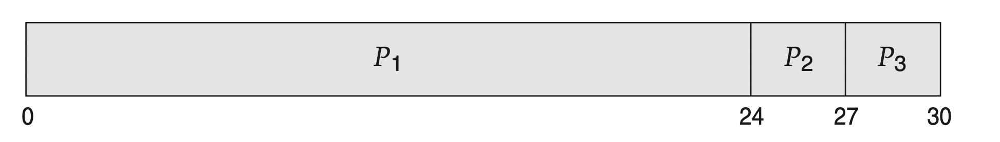
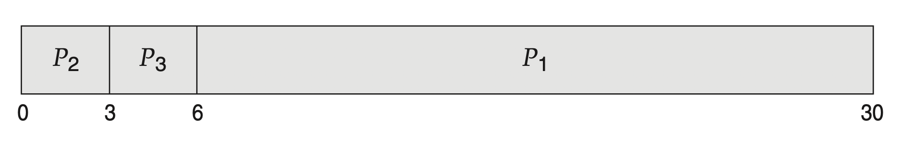
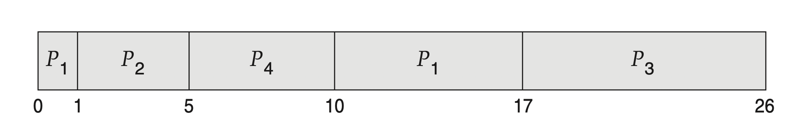

---

# multiple category is not supported
category: Operating System
# multiple tag entries are possible
tags: [Operating System]
# thumbnail image for post
img: ":os-logo.png"

# publish date
date: 2023-02-14 20:14:00 +0900
---

### Scheduling Algorithms
+ First-Come, First-Served Scheduling
+ Shortest-Job-First Scheduling
+ Round-Robin Scheduling
+ Priority Scheduling
+ Multilevel Queue Scheduling
+ Multilevel Feedback Queue Scheduling

#### First-Come, First-Served Scheduling
처음으로 CPU를 요청한 프로세스는 처음으로 CPU를 할당되어진다. FIFO queue와 함께 쉽게 수행된다. 프로세스가 레디 큐에 들어갈 때 그것의 PCB는 그 큐의 꼬리에 연결되어진다. CPU가 프리해지면 그것은 큐의 헤드에 프로세스를 할당시킨다. 그 동작하는 프로세스는 큐로 부터 제거된다.  
단점은 `평균 대기시간이 길다.`

**예**
아래의 `간트 차트`를 비교해보자.
|Process|Burst Time|
|:---:|:---:|
|$P_1$|24|
|$P_2$|3|
|$P_3$|3|

평균 대기 시간 : $(0 + 24 +27)/3 = 17ms$

평균 대기 시간 :$(6 + 3 + 0 )/3 = 3ms$
`convoy effect`가 있다. 이것은 다른 프로세스들이 하나의 큰 프로세스가 CPU에서 벗어나기를 기다리는 것이다.

#### Shortest-Job-First Scheduling
다음 실행에 가장 짧은 실행 시간을 가진 프로세스를 먼저 할당하는 것이다.
`shortest-remaining- time-firs`라고도 불린다.

##### 종류 
+ Non-Preemptive SJF
+ Preemptive SJF

**예**

**Non-Preemptive SJF**
|Process|Arrival Time|Burst Time|
|:---:|:---:|:---:|
|$P_1$|0|8|
|$P_2$|1|4|
|$P_3$|2|9|
|$P_4$|3|5|

1. `t = 0`
$P_1$밖에 없으므로 $P_1$을 작업을 진행한다.
1. `t = 1`
$P_2$가 도착하는데 비선점이므로 계속 진행
1. `t = 8`

|Process|Arrival Time|Burst Time|
|:---:|:---:|:---:|
|$P_1$|0|0|
|$P_2$|1|4|
|$P_3$|2|9|
|$P_4$|3|5|

+ $P_1$ 작업이 끝
+ $P_2$ $P_3$ $P_4$ 중에서 $P_2$가 짧으므로 $P_2$를 선택한다.

그 후 짧은 순서로 진행 시키면 간트 표와 같이 표현된다.

평균 대기 시간 : (0 + (8-1) + (12-3) + (17-2))/4 = 31/4 = 7.75ms

**Preemptive SJF**
|Process|Arrival Time|Burst Time|
|:---:|:---:|:---:|
|$P_1$|0|8|
|$P_2$|1|4|
|$P_3$|2|9|
|$P_4$|3|5|

1. `t = 0`
$P_1$밖에 없으므로 $P_1$을 작업을 진행한다.
1. `t = 1`
$P_2$가 도착하는데 $P_1$의 작업시간은 7( = 8- 1) $P_2$의 작업시간은 4 더 짧은 $P_2$ 선택한다.
1. `t = 2`
$P_3$가 도착하는데 $P_3$의 작업시간은 9이므로 $P_2$를 계속 진행시킨다.
1. `t = 3`
$P_4$가 도착하는데 $P_2$의 작업 시간은 2(4-(3-1))이므로 $P_2$가 계속 진행된다.
1. `t = 5`

|Process|Arrival Time|Burst Time|
|:---:|:---:|:---:|
|$P_1$|0|7( = 8-1)|
|$P_2$|1|완료|
|$P_3$|2|9|
|$P_4$|3|5|
+ $P_2$ 작업이 끝
+ $P_1$ $P_3$ $P_4$ 중에서 $P_4$가 짧으므로 $P_4$를 선택한다.

그 후 짧은 순서로 진행 시키면 간트 표와 같이 표현된다.

평균 대기 시간 : $((10 - 1)+(1 - 1)+(17 -2 )+(5 - 3))/4 = 26/4 = 6.5ms$

#### Round-Robin Scheduling

라운드 로빈 스케줄링  알고리즘은 FCFS 스케줄링 알고리즘과 유사하다.
 그러나, 프로세스들 사이에 전환 시스템을 할 수 있다는인 `선점(preemption)`  추가되었다.

작은 시간 단위인 `time quantum` 또는 `time slice`로 정의된다.

#### Priority Scheduling

A major problem with priority scheduling algorithms is indefinit block- ing, or starvation

A solution to the problem of indefinite blockage of low-priority processes is aging. 

Another option is to combine round-robin and priority scheduling 
#### Multilevel Queue Scheduling

#### Multilevel Feedback Queue Scheduling

